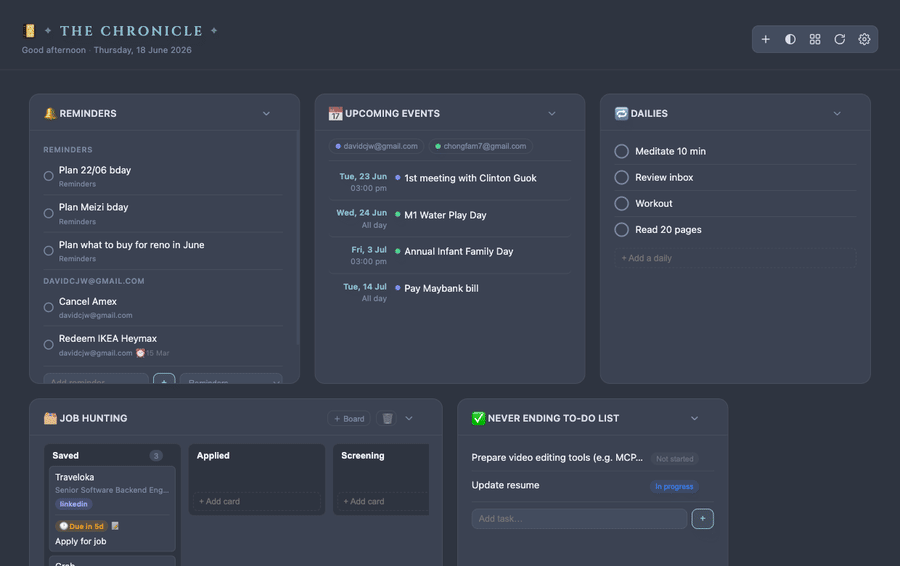

# The Chronicle v2


A one-click desktop version of [The Chronicle](../the-chronicle) personal dashboard, built for **non-technical users**: no terminal, no editing config files, no `.env`. You pick the widgets you want and connect your accounts from an in-app **Settings** panel.

<p align="center">
  
</p>

## Table of Contents

- [What's different from v1](#whats-different-from-v1)
- [Architecture](#architecture)
- [Run it (browser / dev)](#run-it-browser--dev--no-display-needed)
- [Run it as the desktop app](#run-it-as-the-desktop-app)
- [Build a distributable .dmg](#build-a-distributable-dmg)
- [Onboarding notes](#onboarding-notes-the-honest-part)
- [Data location](#data-location)
- [Contributing](#contributing)
- [Code of Conduct](#code-of-conduct)
- [License](#license)
- [Acknowledgements](#acknowledgements)

## What's different from v1

| | v1 | v2 |
|---|---|---|
| Install | Node + `npm` + PM2 | Double-click app (Electron) |
| Choose widgets | edit `dashboard.config.js` | toggle switches in Settings |
| API keys | edit `.env` | paste into Settings, masked |
| Connect Google | manual OAuth URL | "Connect Google" button |
| Plugins/widgets | _unchanged — reused as-is_ | _unchanged — reused as-is_ |

The widget plugins themselves are identical to v1. v2 only adds a settings store, an in-app UI, and an Electron shell around them.

## Architecture

```
electron/main.cjs   ── forks the server, shows the window, re-forks on save,
                        routes OAuth popups so the localhost callback works
src/supervisor.js   ── same re-fork loop for browser/dev mode (no Electron)
src/server.js       ── Express app; reads config + secrets from the store,
                        serves /api/settings, exits with code 86 to restart
src/settingsStore.js ─ one settings.json (config + secrets) in the user data dir
src/settingsSchema.js ─ declares the fields each plugin shows in Settings
dashboard.config.js ── shim so v1 plugins keep importing config unchanged
public/settings.js  ── the Settings drawer (auto-rendered from the schema)
plugins/ public/    ── copied verbatim from v1
```

**How a settings save works:** the renderer POSTs to `/api/settings` → the store is
written → the server exits with code `86` → the supervisor (or Electron) re-forks it
with fresh config/secrets → the page reloads and the new widgets appear.

## Run it (browser / dev — no display needed)

```bash
npm install
npm run server        # → http://localhost:3737
```

Open the URL, click **⚙ Settings**, toggle widgets, paste keys, save.

## Run it as the desktop app

```bash
npm install
npm start             # launches the Electron window
```

## Build a distributable `.dmg`

```bash
npm run dist          # → dist/The Chronicle-<version>-arm64.dmg
```

The build is **unsigned** (`mac.identity: null` in `package.json`) — no Apple
Developer account needed. The tradeoff: macOS Gatekeeper will warn on first launch.

### First launch on an unsigned app (tell your users this once)

After dragging the app to Applications, the **first** time they open it:

1. **Right-click** (or Control-click) the app → **Open**
2. In the dialog, click **Open** again

macOS remembers the choice — every launch after that is a normal double-click.
(A plain double-click on the first try just shows a "can't be opened" dialog with no
Open button, which is why the right-click step matters.)

If macOS still blocks it (newer versions are stricter), they can clear the
quarantine flag once:

```bash
xattr -dr com.apple.quarantine "/Applications/The Chronicle.app"
```

### Going warning-free later

When you're ready to remove the friction entirely, it's a config-only change: an
Apple Developer account ($99/yr) plus signing + notarization settings in the
`mac` build block. Nothing else about the app changes.

## Onboarding notes (the honest part)

A desktop app removes the install friction but **not** the account-setup friction:
- **News** and **Apple Reminders** work with zero keys — the app shows something useful immediately.
- **Notion / GitLab** need a token pasted once.
- **Google Calendar** still needs you to create an OAuth client in Google Cloud Console (the Settings field links you there). The redirect URI must be `http://localhost:3737/auth/google/callback`. After that, the "Connect Google" button handles the rest.

## Data location

- Desktop app: `~/Library/Application Support/The Chronicle/settings.json`
- Dev mode: `./data/settings.json` (gitignored)

Secrets live only in that local file and are never sent anywhere except the
respective service's own API. The Settings API never returns secret values back to
the browser — only whether each one is set.

## Contributing

Contributions are welcome! Please open an issue first to discuss what you'd like to change.

1. Fork the repo
2. Create a feature branch (`git checkout -b feature/your-feature`)
3. Commit your changes (`git commit -m 'feat: describe change'`)
4. Push and open a pull request

Please make sure the app still builds (`npm run dist`) before submitting a PR.

## Code of Conduct

This project follows the [Contributor Covenant v2.1](https://www.contributor-covenant.org/version/2/1/code_of_conduct/).
By participating you agree to uphold a welcoming, harassment-free environment.

## License

Distributed under the MIT License. See [LICENSE](LICENSE) for details.

## Acknowledgements

- Built on top of [The Chronicle v1](../the-chronicle) — the widget plugins are reused as-is.
- [Electron](https://www.electronjs.org/) for the desktop shell and [electron-builder](https://www.electron.build/) for packaging.
- [gridstack.js](https://gridstackjs.com/) for the draggable, resizable dashboard layout.
